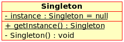

:source-highlighter: pygments

=== Singleton
[sidebar]
Garantir que uma classe tenha uma, e somente uma, instância, mantendo um ponto global de acesso.

'''
[.left]
.Image B

'''
==== Como implementar
 . Criar um construtor padrão privado para impedir que se consiga instanciar a classe.
 . Criar um atributo private e estático do mesmo tipo da classe.
 . Criar o método "getInstance()". Esse é o principal ponto da classe.Ele verifica se a variável instance já foi iniciada, caso não tenha sido, ele faz sua criação pela primeira e única vez.
 . Para fazer a conexão, devemos chamar o getInstance da seguinte forma: ClasseSingleton.getInstance().

===== Prós
* Você pode ter certeza que uma classe só terá uma única instância.
* Você ganha um ponto de acesso global para aquela instância.
* O objeto singleton é inicializado somente quando for pedido pela primeira vez.

===== Contras
* Viola o princípio de responsabilidade única. O padrão resolve dois problemas de uma só vez.
* O padrão Singleton pode mascarar um design ruim, por exemplo, quando os componentes do programa sabem muito sobre cada um.
* O padrão requer tratamento especial em um ambiente multithreaded para que múltiplas threads não possam criar um objeto singleton várias vezes.
* Pode ser difícil realizar testes unitários do código cliente do Singleton porque muitos frameworks de teste dependem de herança quando produzem objetos simulados. Já que o construtor da classe singleton é privado e sobrescrever métodos estáticos é impossível na maioria das linguagem, você terá que pensar em uma maneira criativa de simular o singleton. Ou apenas não escreva os testes. Ou não use o padrão Singleton.

===== Exemplo Java

[source,java]
----
public class Singleton {
    // The field must be declared volatile so that double check lock would work
    // correctly.
    private static volatile Singleton instance;

    public String value;

    private Singleton(String value) {
        this.value = value;
    }

    public static Singleton getInstance(String value) {
        // The approach taken here is called double-checked locking (DCL). It
        // exists to prevent race condition between multiple threads that may
        // attempt to get singleton instance at the same time, creating separate
        // instances as a result.
        //
        // It may seem that having the `result` variable here is completely
        // pointless. There is, however, a very important caveat when
        // implementing double-checked locking in Java, which is solved by
        // introducing this local variable.
        //
        // You can read more info DCL issues in Java here:
        // https://refactoring.guru/java-dcl-issue
        Singleton result = instance;
        if (result != null) {
            return result;
        }
        synchronized(Singleton.class) {
            if (instance == null) {
                instance = new Singleton(value);
            }
            return instance;
        }
    }
    
}
----

===== Fonte
link:https://refactoring.guru/pt-br/design-patterns/singleton/java/example#example-2[Refactoring Guru : Singleton]

